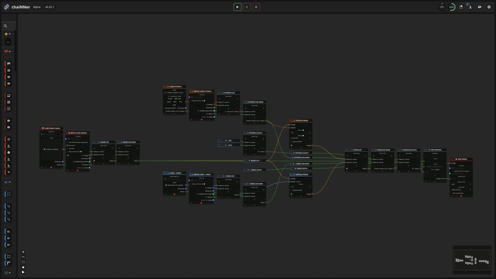
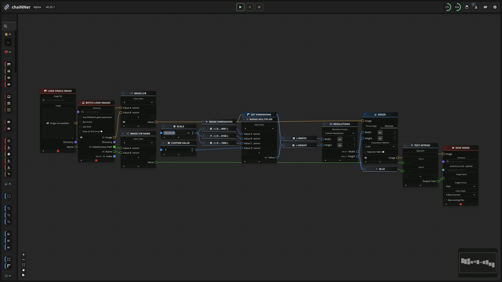

# chaiNNer-Universal-Toolkit

## A Universal toolkit for chaiNNer

### Universal Upscaler v1.4

#### A multipurpose upscaling chain

##### Features: 
- single and batch images and models
- onnx and pytorch models
- easy to follow chain logic
- upscale tile sizes
- output ready naming system: ( filename + upscaler + prefix )

### Universal Resizer v1.4

#### A multipurpose resizing chain

### Features:
- single and batch images
- multiplier ranges (0-1), (0-100), (0,1000)
- direct manual input
- resolution presets
- interpolation methods
- output-ready naming system: ( filename + dimensions + interpolation method)

##### How to Use

*__Note__ : All nodes need to have inputs, even if you are not using them, otherwise the chain won't run.*

##### Universal Upscaler v1.4
 
The upscale chain logic is simple: it starts on the left and has 3 main types of elements:

1. Image Loading
2. Model Loading
3. Switches

To operate the chain follow the same logic from left to right:

1. Load a single image and model of your choice, or a folder for batch processing (for either)

2. Set the next switch accordingly:
 - A for single elements
 - B for batch

3. Set the name-switch the same as the preceding switch

4. Set the Upscaler type switch:
 - A for PyTorch
 - B for ONNX

5. Set the Upscaler name switch the same as the chosen type

6. Set the model prefix type:
 - PTH for .pth
 - SFT for .safetensors
 - ONNX for .onnx files

7. Run the chain!

##### Universal Resizer v1.4

The resize chain logic is straight forward, it follows the same order from left to right, and offers 2 methods for resizing:

1. Based on a multiplier
2. Based on an output dimension

To operate the chain:

1. Load your image to resize, or a folder for batch processing
2. Set the next switch accordingly:
 - A for single elements
 - B for batch
3. Set the name-switch the same as the preceding switch
4. Set a value the range slider (0-100%)
5. Choose the multiple in the range multiplier switch:
 - A for x0.1
 - B for x1
 - C for x10
 - D for a custom multiplier value
6. If you prefer a resolution preset (HD, UHD, 4k, NTSC, etc) choose one from the Resolutions node
7. Set the Interpolation Method (Bilinear, BiCubic, Lanczos etc) in the Resize node
8. Add the chosen method in the 'Text Append' node
9. Run the chain!

---

*(If you have any suggestions feel free to reach out via linked socials, I am looking forward to hear your thoughts.)*
